<div align="center">

<a href="https://domw99.github.io/Gods-Eye-UAPs/">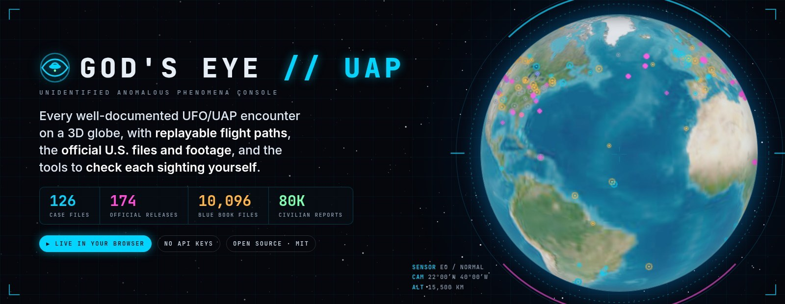</a>

### [▶ Open the live app](https://domw99.github.io/Gods-Eye-UAPs/)

It runs in your browser with nothing to install and no sign-up or API keys.

[](https://domw99.github.io/Gods-Eye-UAPs/)
[](https://github.com/domw99/Gods-Eye-UAPs/actions/workflows/ci.yml)
[](https://github.com/domw99/Gods-Eye-UAPs/actions/workflows/pages.yml)
[](#quick-start)
[](https://cesium.com/platform/cesiumjs/)
[](LICENSE)

**[Features](#features)** · **[Quick start](#quick-start)** · **[How it works](#how-it-works)** · **[Data](#where-the-data-comes-from)** · **[Reading it honestly](#how-to-read-the-map-honestly)** · **[Contributing](#contributing)**

</div>

---

**God's Eye // UAP** puts every well-documented UFO/UAP encounter on a 3D globe. You can replay each one along a reconstructed flight path, read the official U.S. and French files, search 22,000 pages of the MUFON, APRO, NICAP and CUFOS journals, and watch the footage. You can also check the ordinary explanations yourself: what was in the sky, the weather, military airspace and rocket launches. It is a UAP-only edition of Bilawal Sidhu's [God's Eye View](https://github.com/bilawalsidhu/gods-eye-view).

<div align="center">

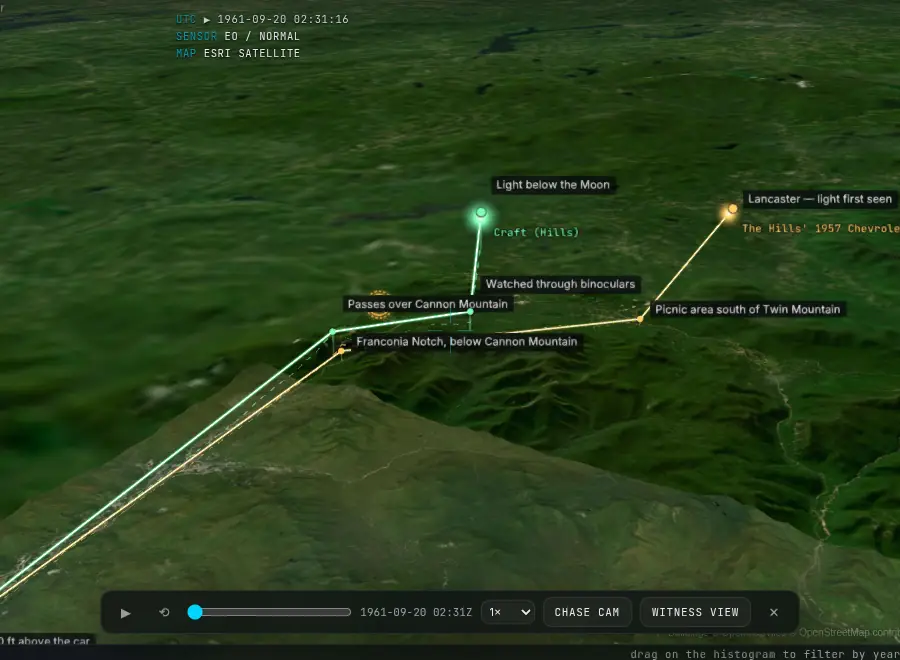

<sub><b>Betty and Barney Hill, 1961.</b> The car's route and the craft's reported path replayed over the White Mountains, cycling through Normal → NVG → FLIR → Ironbow.</sub>

</div>

| | | | |
|:---:|:---:|:---:|:---:|
| **126** curated case files<br><sub>1561 → 2024, every continent</sub> | **174** official U.S. releases<br><sub>AARO / PURSUE footage via DVIDS</sub> | **10,096** Project Blue Book files<br><sub>USAF scans, 1947–1969, on the map</sub> | **2,768** GEIPAN files<br><sub>France's official cases, graded A–D</sub> |
| **485** MUFON Journal issues<br><sub>1967–2008 · 2,517 report places mapped</sub> | **872** research journal issues<br><sub>APRO · NICAP · CUFOS · MUFON chapters</sub> | **22,000** journal pages<br><sub>full-text searchable in the app</sub> | **80,332** civilian reports<br><sub>NUFORC, as a density layer</sub> |

## Features

### 🌍 Every documented encounter on one globe

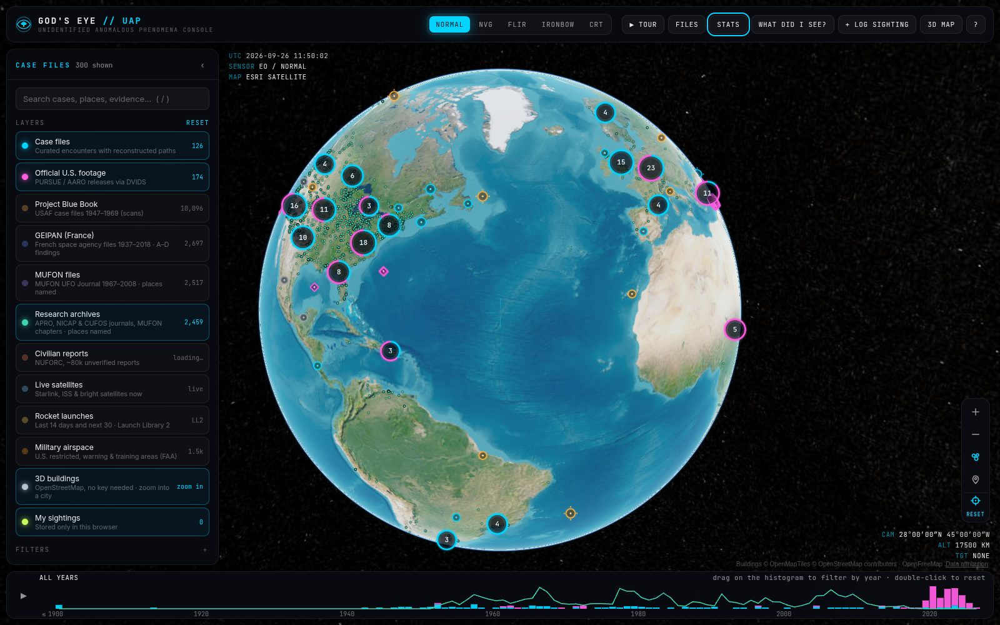

- **126 curated case files** from 1561 to 2024. Examples: Kenneth Arnold, Washington 1952, the Kinross F-89, the RB-47, Socorro, the Hills, Minot AFB 1968, Rendlesham, Tehran 1976, JAL 1628, the Belgian wave, the Phoenix Lights, the Nimitz "Tic Tac", Gimbal/GoFast, Aguadilla, the 2023 shoot-downs and the 2024 New Jersey drones.
- Each case has evidence tags, witnesses, a timeline, a **0–10 documentation score** and a status: *unresolved*, *disputed*, *explained* or *identified*. The official or best-supported explanation is shown first.
- **The evidence itself, where it survives.** 73 cases show archived photos, film, video or documents. For U.S. cases from 1947–1969 that includes pages from the Air Force's own Blue Book photo files: frames of the 1950 Mariana film, Carl Hart's Lubbock Lights photos, Rex Heflin's Polaroids, the Socorro landing site and the Minot B-52's radar scope.
- **Filter** by status, evidence type or shape (disc, tic tac, triangle, sphere, lights, formation). Brush the year histogram, or press ▶ to sweep through history.
- **Search a place** to see everything reported near it, or press **Near me** (<kbd>N</kbd>) for your own location: cases, Blue Book and GEIPAN files, journal pages and a count of civilian reports.
- **Filters stay in view** as chips above the results, each removable, with **RESET ALL**. **Back and Forward** step through the records you opened, and every record has its own link.
- **Group or ungroup** nearby markers (<kbd>C</kbd>). Labels that would overlap are hidden by priority, so the view stays readable.
- **Share any view**: the address bar keeps the camera position.
- **Reset** (<kbd>R</kbd>, or the button beside the globe) flies back to the whole globe, north up. The **＋ / −** buttons zoom toward the centre of the screen, while wheel zoom heads for the pointer.

### ✈️ Replay the encounter, from the witness's seat

<table>
<tr>
<td width="50%">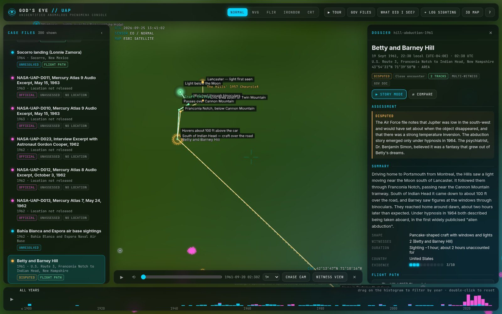</td>
<td width="50%">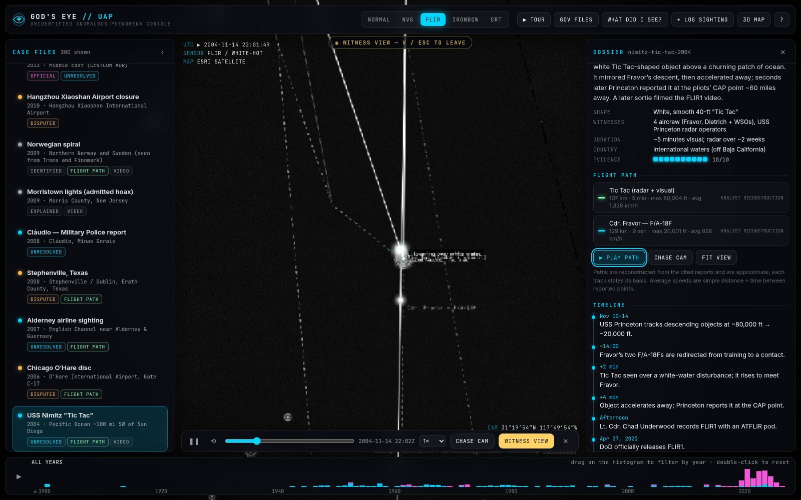</td>
</tr>
<tr>
<td><sub><b>Flight paths at altitude</b> for the UAP and the witnesses (aircraft, interceptors, cars, ships), with a translucent curtain down to the ground, ground tracks and labelled waypoints. Each track states its basis: radar, official report, witness reports, flight plan or approximate.</sub></td>
<td><sub><b>Witness view</b> (<kbd>V</kbd>) puts the camera with the witness, here Cdr. Fravor's F/A-18F, and keeps it on the object. Here it is in FLIR, like the FLIR1 video. <b>Chase cam</b> follows the object instead.</sub></td>
</tr>
</table>

### 🎛 See it through a sensor

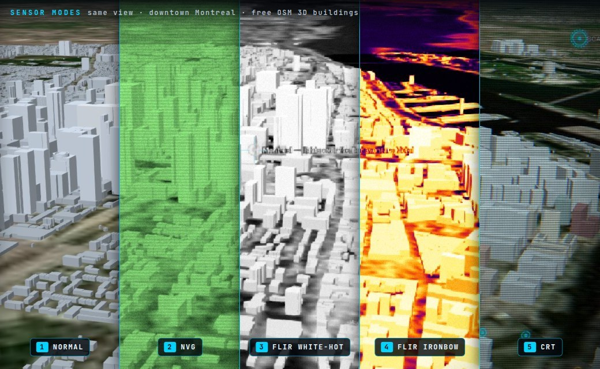

There are five sensor looks, rendered as real-time post-processing shaders (keys <kbd>1</kbd>–<kbd>5</kbd>):
- **Normal**
- **NVG**: image-intensifier gain, shot noise and raster lines.
- **FLIR white-hot**: a low-resolution microbolometer look.
- **FLIR Ironbow**
- **CRT**

**3D buildings are free.** OpenStreetMap buildings (via OpenFreeMap) appear as you zoom into any town. If you want Google's photorealistic 3D tiles instead, paste your own key under **3D MAP**.

### 🔭 Check it yourself

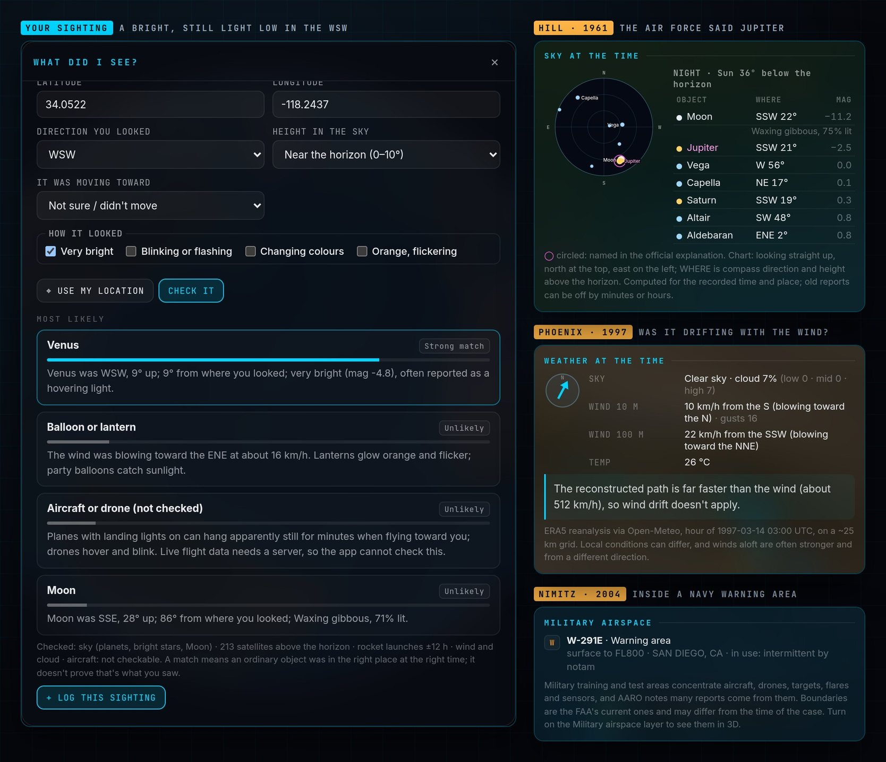

- **What did I see?** (<kbd>E</kbd>) Enter a time, place, direction and how it moved. The app ranks the ordinary explanations it can test:
  - planets, bright stars and the Moon;
  - sunlit satellites, Starlink trains and the ISS;
  - rocket launches;
  - lanterns or balloons on the wind.

  Aircraft are listed as not checkable. Above, a bright, still light low in the WSW at dusk comes back as **Venus**.
- **The sky at that moment**, for every case: Sun, Moon phase, planets and bright stars. Objects named in the official explanation are circled. For the Hills in 1961, Jupiter sits low in the SSW beside the Moon, just as the Air Force file says.
- **Historical weather** since 1940 (ERA5): cloud layers, wind at 10 m and 100 m, and whether a slow object moved with the wind.
- **Military airspace**: which FAA restricted or warning areas a case falls in.

<table>
<tr>
<td width="50%">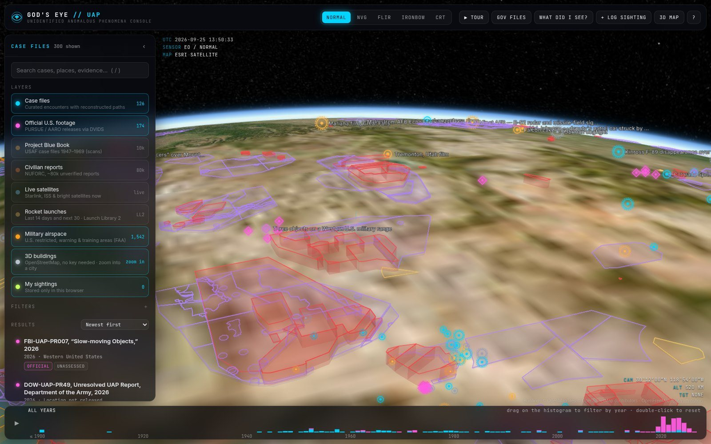</td>
<td width="50%">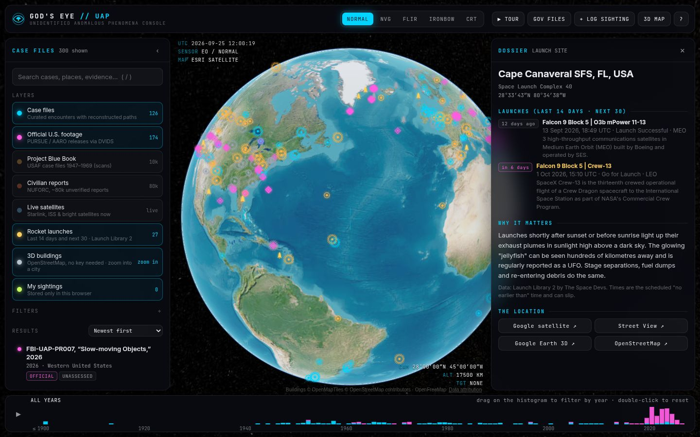</td>
</tr>
<tr>
<td><sub><b>Military airspace</b>: all 1,542 U.S. restricted, warning, MOA, alert and prohibited areas from the FAA, drawn as 3D volumes. Nimitz sits in warning area W-291.</sub></td>
<td><sub><b>Rocket launches</b>: launches from the last 14 days and the next 30 (Launch Library 2). Every case since 1957 can list launches within ±12 hours and how far away they were. Launch plumes are a top source of modern reports.</sub></td>
</tr>
</table>

### 🗂 The official record

<table>
<tr>
<td width="50%">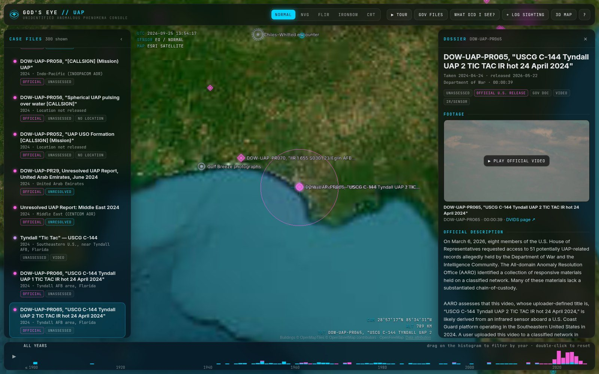</td>
<td width="50%">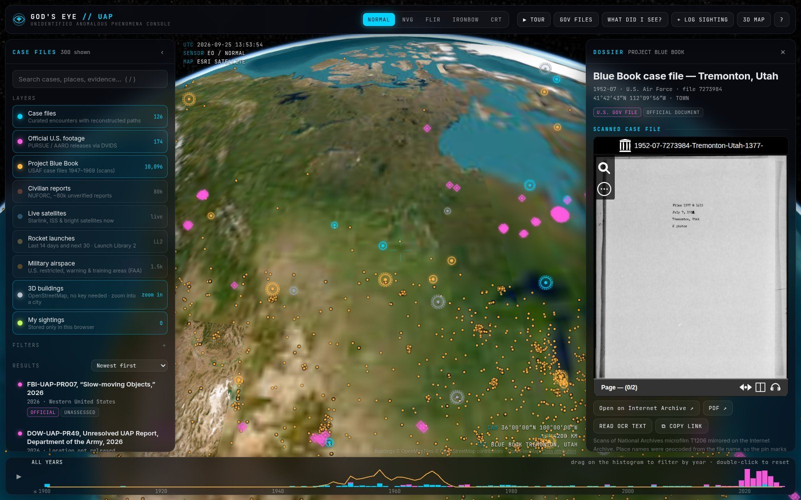</td>
</tr>
<tr>
<td><sub><b>All 174 official UAP videos and images</b> that the Department of War / AARO have published on DVIDS, including the 2026 <b>PURSUE</b> releases. They play inside the app. A release that names only a region is drawn as a ring, not a made-up pin. A weekly job syncs new ones.</sub></td>
<td><sub><b>Project Blue Book on the map.</b> 10,096 USAF case files, geocoded offline. Click one to read the original scan and its OCR text. The <b>files library</b> (<kbd>G</kbd>) links PURSUE, AARO, ODNI, NASA, NARA, Condon, Robertson, the FBI Vault, CIA, AAWSAP, the UK MoD files, GEIPAN, Brazil and Australia.</sub></td>
</tr>
</table>

### 🇫🇷 GEIPAN: France's official UAP files

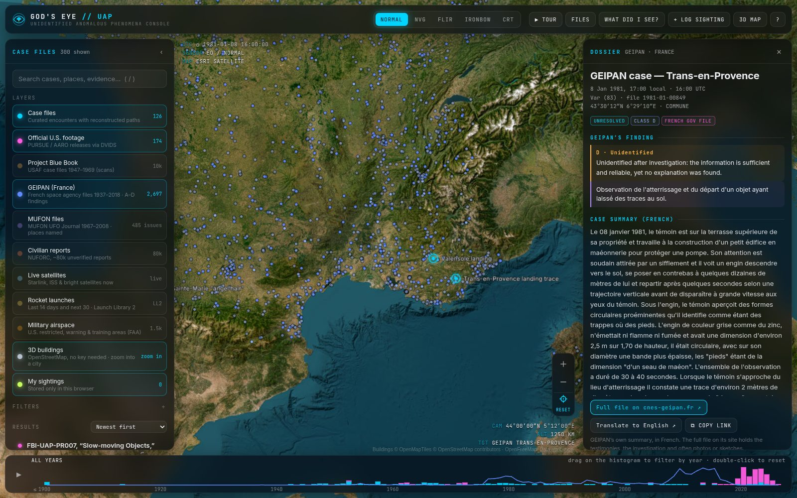

GEIPAN is the UAP office of CNES, the French space agency, and the longest-running government UAP office in the world (since 1977, first as GEPAN). It has published its case files since 2007. The **GEIPAN layer** (blue) puts all **2,768 cases** from its published files (1937–2018) on the map:

- **Each case sits at its commune**, geocoded offline from GeoNames. 95% are placed to the commune; the rest to their department.
- **GEIPAN's own finding comes first**: A (identified), B (probably identified), C (not enough information) or D (unidentified after investigation). The status filters use it, and the unexplained D cases are drawn brightest.
- **The dossier shows GEIPAN's summary in French**, with a link to the full file (testimonies, investigation, often photos) and a one-click English translation.
- **2,607 cases have an observation time**, so the dossier adds the sky, the weather and the day/night lighting at that moment, as it does for curated cases.
- **Curated French cases list their GEIPAN files.** Trans-en-Provence and Valensole both link to their class D files.

### 🛸 The MUFON files

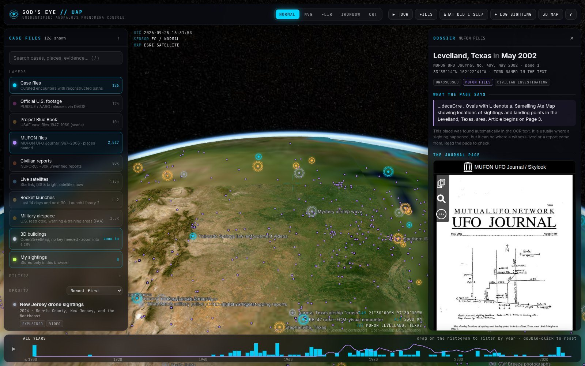

MUFON and The Black Vault released the Mutual UFO Network's journal free as "The MUFON Archive". The app brings it onto the map:

- **485 issues of *Skylook* and the *MUFON UFO Journal* (1967–2008)**, readable page by page inside the app. The library (<kbd>G</kbd>) lists every issue by year, plus 61 series of MUFON chapter newsletters.
- **The MUFON files layer** (violet) marks **2,517 places named in the journal's sighting reports**. They were found automatically in the OCR text and geocoded offline. Each links to the exact page, with a short quote.
- **Case dossiers list the journal pages that discuss them.** 71 of the 126 cases have coverage, for example:
  - 26 pages on Lonnie Zamora's 1964 Socorro sighting;
  - 60 on Travis Walton;
  - 39 on the 2008 Stephenville lights.
- **MUFON's live case database** (CMS) is members-only, and its terms forbid redistribution, so the app links to it and to MUFON's reporting form rather than copying it.

### 📚 The research archives, searchable

<table>
<tr>
<td width="50%">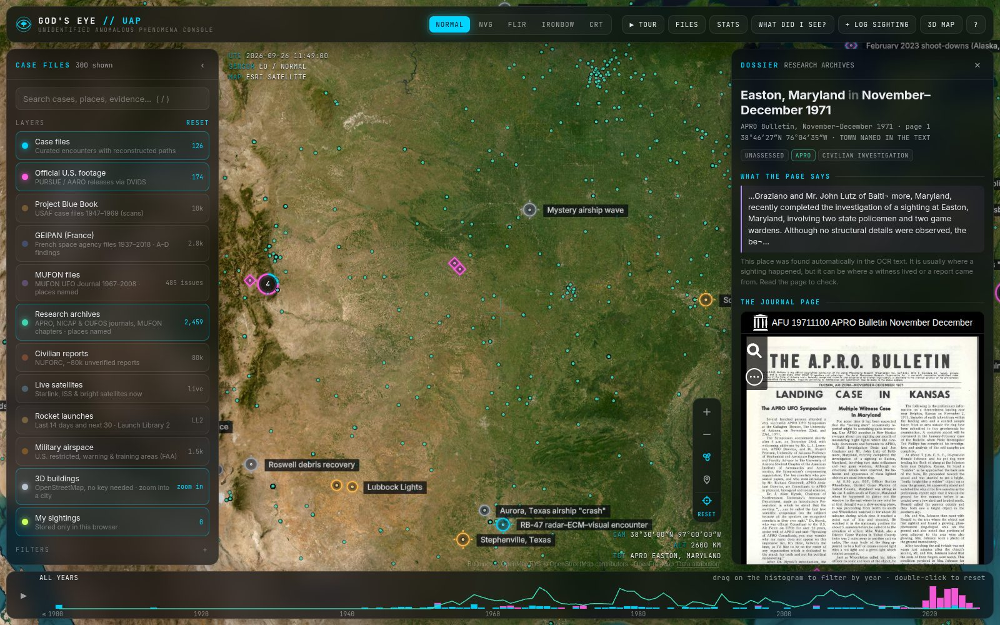</td>
<td width="50%">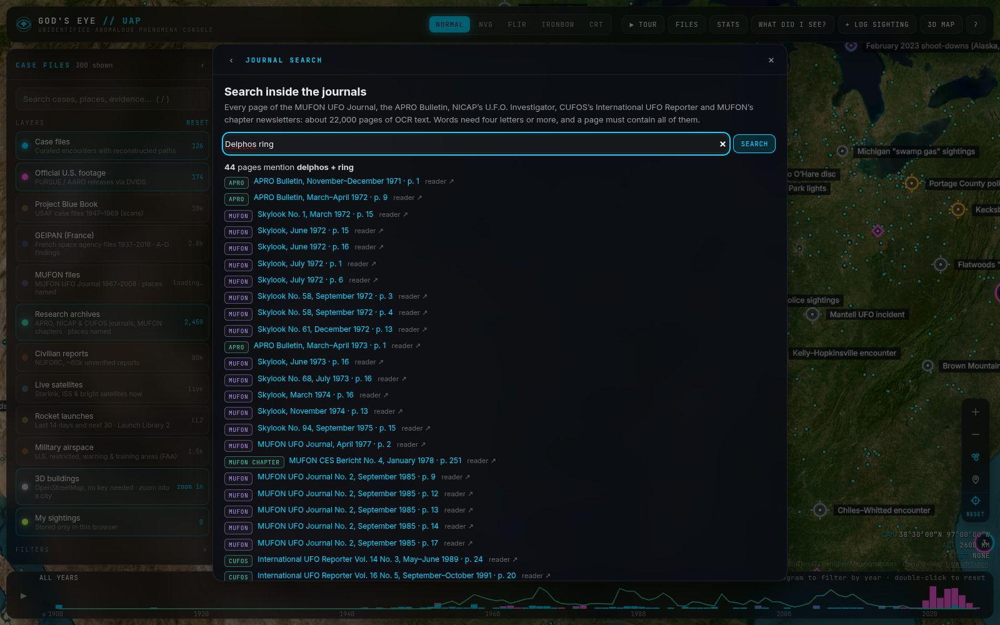</td>
</tr>
<tr>
<td><sub><b>The research archives layer</b> (teal) maps <b>2,459 places</b> named in the sighting reports of the other big civilian groups: the <b>APRO Bulletin</b> (1952–1987), NICAP's <b>U.F.O. Investigator</b>, CUFOS's <b>International UFO Reporter</b> (1976–2009) and MUFON's state chapter newsletters. 78 case dossiers list the pages about them.</sub></td>
<td><sub><b>Search inside the journals</b>: every word of about 22,000 OCR pages is indexed, so a search like “Delphos ring” finds the 44 pages across APRO, Skylook and the MUFON Journal that mention both. Results open the page in the app.</sub></td>
</tr>
</table>

### 📊 Statistics, and cards to share

<table>
<tr>
<td width="50%">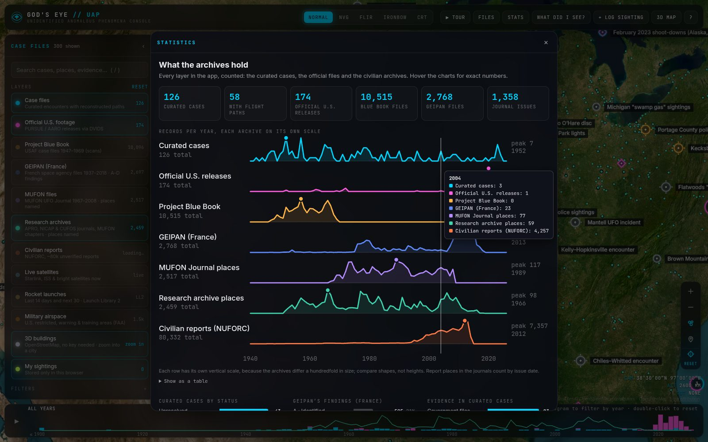</td>
<td width="50%">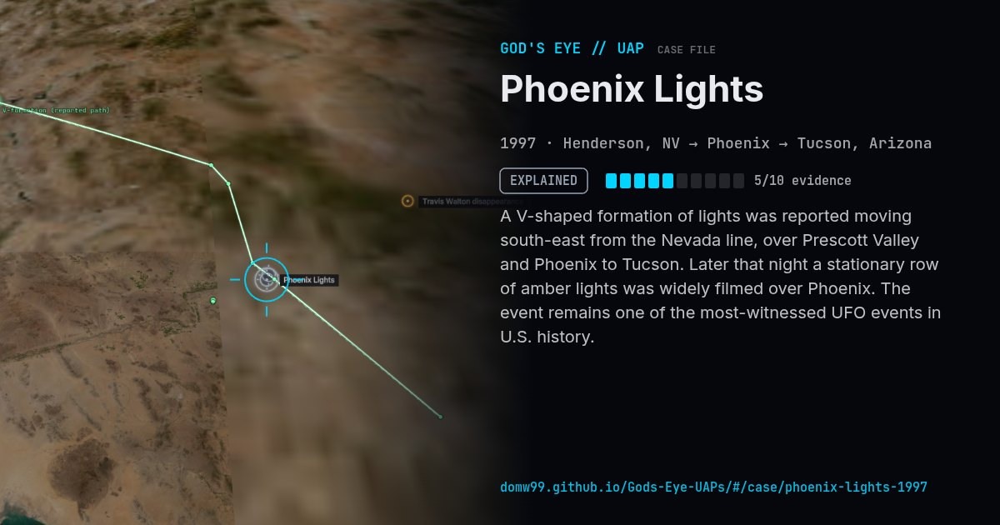</td>
</tr>
<tr>
<td><sub><b>Statistics</b> (<kbd>S</kbd>): what every archive holds, year by year, each on its own scale; the curated cases by status, evidence and country; and GEIPAN's findings, where 4% remain unexplained after investigation.</sub></td>
<td><sub><b>Share cards</b>: ⇪ SHARE on any case makes an image of the globe at the case with its status, evidence score and link. On a phone it opens the share sheet.</sub></td>
</tr>
</table>

### 🎬 Story mode and side-by-side comparison

<table>
<tr>
<td width="50%">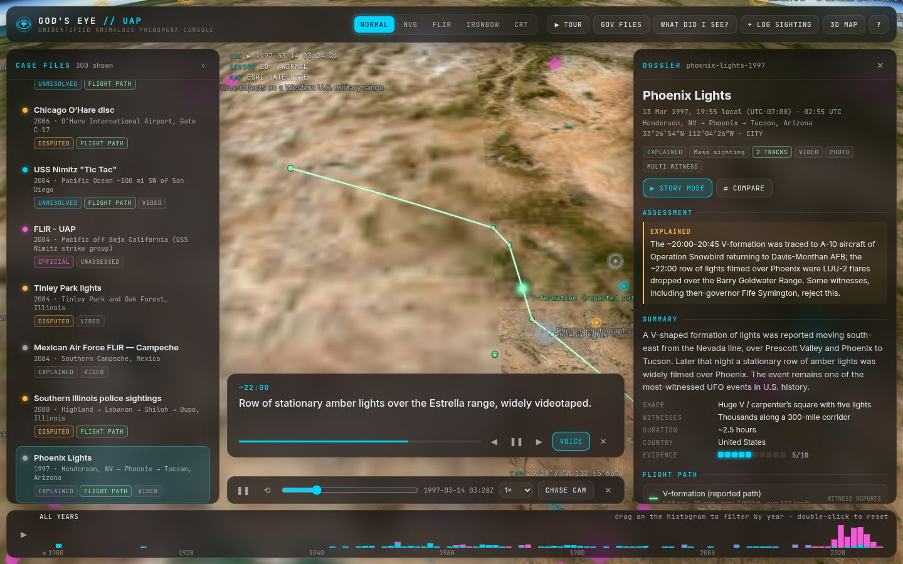</td>
<td width="50%">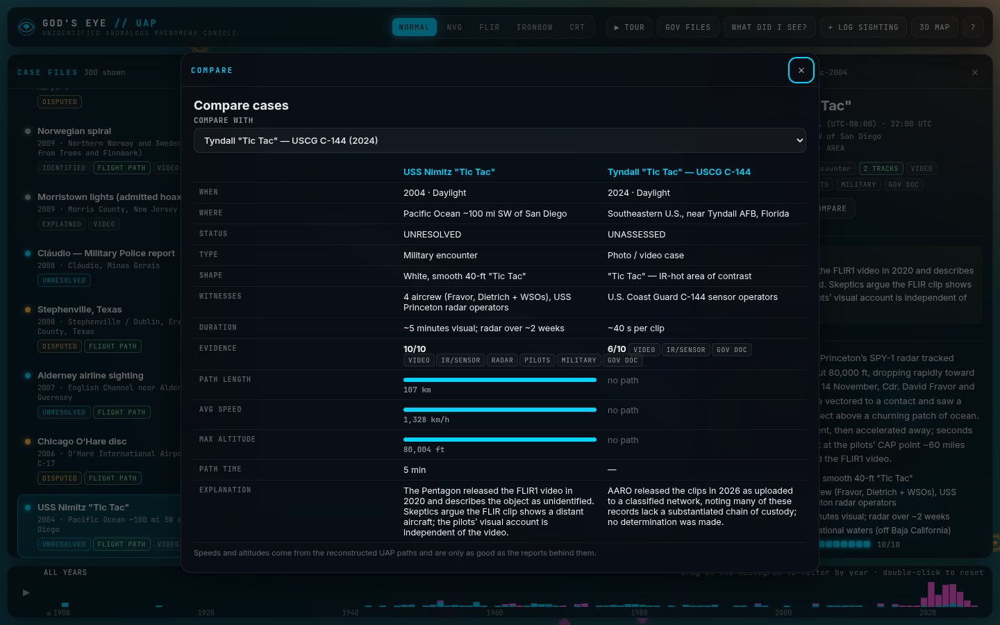</td>
</tr>
<tr>
<td><sub><b>Story mode</b> is a narrated fly-through of any case: the setting, what happened (with the path playing), the sky at that moment and the official assessment. It uses your browser's built-in voice.</sub></td>
<td><sub><b>Compare</b> puts two cases side by side: evidence, witnesses, path length, speed, altitude and the explanation.</sub></td>
</tr>
</table>

### 📱 Works on a phone, and installs like an app

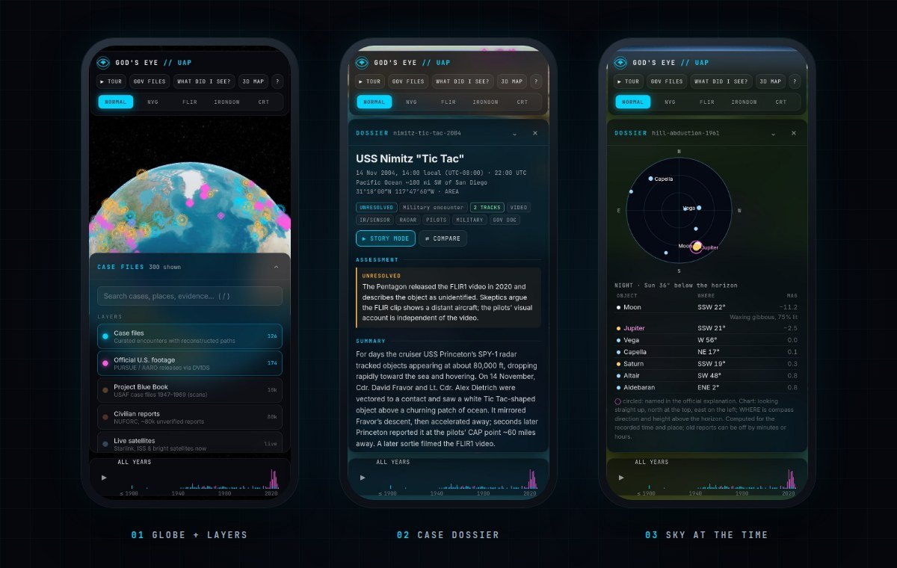

Add it to your home screen from the browser menu. It reopens quickly and works offline for what you have already looked at. The globe only draws when something changes and matches its sharpness to the device, so it stays smooth and easy on the battery.

**Also included:**
- Reference photos, films and audio for each case.
- One-click Google satellite, Street View and Google Earth 3D links.
- A ground-view fly-in.
- A guided tour (<kbd>T</kbd>).
- A personal sighting log (<kbd>L</kbd>), kept in your browser and exportable as GeoJSON, with links to report officially.
- **Suggest a correction** on every case.

## Quick start

```bash
git clone https://github.com/domw99/Gods-Eye-UAPs.git
cd Gods-Eye-UAPs
npm ci
npm run dev        # http://localhost:5173
```

That's it. Nothing needs a key: the imagery, terrain, 3D buildings, weather, launches, satellites and place search all use free, keyless services.

<details>
<summary><b>Optional: Google photorealistic 3D tiles</b></summary>

<br>

In the app, click **3D MAP** (or press <kbd>M</kbd>) and paste a Google Maps Platform key with the **Map Tiles API** enabled. The key stays in that browser's localStorage and is sent only to `tile.googleapis.com`. You can remove it there at any time.

If you host your own copy, you can build keys in instead: copy `.env.example` to `.env`.

| Key | What it adds |
|---|---|
| `VITE_GOOGLE_MAPS_API_KEY` | Google Photorealistic 3D Tiles for every visitor (Map Tiles API) |
| `VITE_CESIUM_ION_TOKEN` | Cesium World Terrain, plus Google 3D Tiles through ion |

Restrict browser keys to your domain, because anything built into the site is public.

</details>

<details>
<summary><b>Keyboard shortcuts</b></summary>

<br>

| Key | Action | Key | Action |
|---|---|---|---|
| <kbd>1</kbd>–<kbd>5</kbd> | Sensor modes | <kbd>E</kbd> | What did I see? |
| <kbd>/</kbd> | Search | <kbd>V</kbd> | Witness view (during playback) |
| <kbd>[</kbd> <kbd>]</kbd> | Previous / next case | <kbd>M</kbd> | 3D map settings |
| <kbd>Space</kbd> | Play / pause the flight path | <kbd>G</kbd> | Files library (government + MUFON) |
| <kbd>T</kbd> | Guided tour | <kbd>L</kbd> | Log a sighting |
| <kbd>R</kbd> | Reset view (whole globe, north up) | <kbd>+</kbd> <kbd>−</kbd> | Zoom toward the centre |
| <kbd>N</kbd> | Near me | <kbd>S</kbd> | Statistics |
| <kbd>C</kbd> | Group nearby markers on / off | <kbd>Esc</kbd> | Close, or back to the previous dialog |
| <kbd>H</kbd> | Hide the HUD | Browser Back | The record you had open before |

</details>

<details>
<summary><b>Deep links</b></summary>

<br>

| Link | Opens |
|---|---|
| [`#/case/nimitz-tic-tac-2004`](https://domw99.github.io/Gods-Eye-UAPs/#/case/nimitz-tic-tac-2004) | A curated case |
| [`#/official/1007777`](https://domw99.github.io/Gods-Eye-UAPs/#/official/1007777) | An official release (DVIDS id) |
| [`#/bluebook/1952-07-7273984-Tremonton-Utah-1377-`](https://domw99.github.io/Gods-Eye-UAPs/#/bluebook/1952-07-7273984-Tremonton-Utah-1377-) | A Blue Book file |
| [`#/geipan/1981-01-00849`](https://domw99.github.io/Gods-Eye-UAPs/#/geipan/1981-01-00849) | A GEIPAN file (Trans-en-Provence) |
| [`#/mufon/2002_05/1`](https://domw99.github.io/Gods-Eye-UAPs/#/mufon/2002_05/1) | A MUFON Journal page (issue, page index) |
| [`#/journal/AFU_19711100_APRO_Bulletin_November-December/0`](https://domw99.github.io/Gods-Eye-UAPs/#/journal/AFU_19711100_APRO_Bulletin_November-December/0) | A research-archive page (APRO Bulletin, Nov–Dec 1971) |
| [`#/near/33.3943,-104.5230/Roswell`](https://domw99.github.io/Gods-Eye-UAPs/#/near/33.3943,-104.5230/Roswell) | Everything reported near a place |
| [`?mode=nvg`](https://domw99.github.io/Gods-Eye-UAPs/?mode=nvg) | Start in a sensor mode |
| [`?layers=bluebook,geipan,mufon`](https://domw99.github.io/Gods-Eye-UAPs/?layers=bluebook,geipan,mufon) | Start with extra layers on |
| [`?view=-104.5,33.7,25000,0,-35`](https://domw99.github.io/Gods-Eye-UAPs/?view=-104.5,33.7,25000,0,-35) | Start at a camera position (lon, lat, height m, heading°, pitch°) |

</details>

## How it works

It is a static site with no backend. Datasets are built by scripts ahead of time and shipped as JSON. Everything live is fetched straight from keyless public APIs in the browser, and the sky and satellite positions are computed on the device.

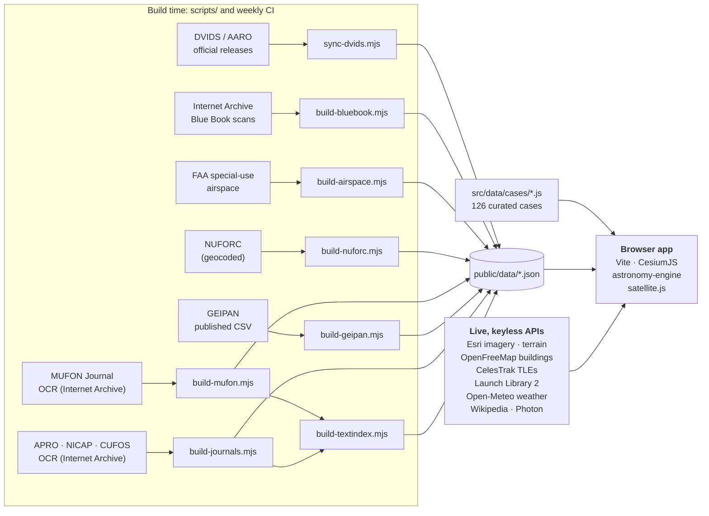
```mermaid
flowchart LR
  subgraph build["Build time: scripts/ and weekly CI"]
    direction TB
    DVIDS["DVIDS / AARO<br/>official releases"] --> S1["sync-dvids.mjs"]
    IA["Internet Archive<br/>Blue Book scans"] --> S2["build-bluebook.mjs"]
    FAA["FAA special-use<br/>airspace"] --> S3["build-airspace.mjs"]
    NUF["NUFORC<br/>(geocoded)"] --> S4["build-nuforc.mjs"]
    MUF["MUFON Journal<br/>OCR (Internet Archive)"] --> S5["build-mufon.mjs"]
    GEI["GEIPAN<br/>published CSV"] --> S6["build-geipan.mjs"]
    ARC["APRO · NICAP · CUFOS<br/>OCR (Internet Archive)"] --> S7["build-journals.mjs"]
    S5 & S7 --> S8["build-textindex.mjs"]
  end
  S1 & S2 & S3 & S4 & S5 & S6 & S7 & S8 --> DATA[("public/data/*.json")]
  CASES["src/data/cases/*.js<br/>126 curated cases"] --> APP
  DATA --> APP["<b>Browser app</b><br/>Vite · CesiumJS<br/>astronomy-engine<br/>satellite.js"]
  LIVE["<b>Live, keyless APIs</b><br/>Esri imagery · terrain<br/>OpenFreeMap buildings<br/>CelesTrak TLEs<br/>Launch Library 2<br/>Open-Meteo weather<br/>Wikipedia · Photon"] --> APP
```

| Layer | Code |
|---|---|
| Globe, imagery, terrain, 3D tiles, key handling | `src/app/viewer.js` |
| Rendering on demand, device quality, dynamic resolution | `src/app/quality.js` |
| NVG / FLIR / Ironbow / CRT shaders | `src/app/effects.js` |
| Case markers, flight paths & playback, witness view | `src/layers/items.js`, `src/layers/tracks.js` |
| Label decluttering; Blue Book, GEIPAN, MUFON, research-archive & NUFORC points, satellites, launches, airspace, buildings | `src/layers/*.js` |
| Sky, weather, launches, airspace, GEIPAN classes, journal pages and full-text search, sighting-checker scoring | `src/services/*.js` |
| Dossier, list, timeline, modals, sky chart, story mode, statistics, share cards | `src/ui/*.js` |

<details>
<summary><b>Project structure</b></summary>

```
src/
  app/        viewer.js (globe, imagery, terrain, 3D tiles) · effects.js (NVG/FLIR/CRT shaders)
              quality.js (render on demand, device quality) · horizon.js (markers hidden behind the Earth)
  data/       cases/ (curated case files) · govFiles.js · regions.js · taxonomy.js · items.js
  layers/     items.js (case & release markers) · tracks.js (flight paths + playback)
              points.js (Blue Book / GEIPAN / MUFON / NUFORC) · satellites.js (live SGP4)
              buildings.js (keyless OpenStreetMap 3D buildings) · launches.js (launch pads)
              airspace.js (military airspace volumes) · declutter.js (label overlap)
  services/   wiki.js (Wikipedia summaries, Commons media) · sky.js (planets, Moon, stars)
              launches.js (Launch Library 2) · weather.js (Open-Meteo) · airspace.js (FAA SUA)
              explain.js (sighting checker scoring) · mufon.js (MUFON Journal issues & page text)
              geipan.js (GEIPAN classes, dates, links) · journals.js (APRO, NICAP, CUFOS)
              textsearch.js (journal full-text search)
  ui/         list.js · dossier.js · timeline.js · modals.js · skychart.js · story.js
              stats.js (statistics charts) · sharecard.js (share images)
scripts/      sync-dvids.mjs · build-bluebook.mjs · build-nuforc.mjs · build-airspace.mjs
              build-mufon.mjs · build-geipan.mjs · build-journals.mjs · build-textindex.mjs
              verify-media.mjs · check-links.mjs · fix-cesium-base.mjs · lib/ (GeoNames gazetteer)
tests/        Vitest suites · e2e/ Playwright browser tests
docs/SPEC.md  the full product spec (the improved prompt this was built from)
```

</details>

## Where the data comes from

All datasets ship in `public/data/` and are rebuilt by scripts:

| Command | Source | Output |
|---|---|---|
| `npm run sync:official` | [DVIDS](https://www.dvidshub.net/unit/AARO) search, then each asset page (title, date, description, duration, thumbnail). Regions are resolved by `src/data/regions.js`. Runs weekly in CI. | `official-uap-media.json` |
| `npm run build:bluebook` | Internet Archive collection [`project-blue-book`](https://archive.org/details/project-blue-book), geocoded offline with [GeoNames](https://www.geonames.org/) cities1000 | `bluebook.json` |
| `npm run build:airspace` | FAA special-use airspace (ArcGIS open data), simplified | `airspace.json` |
| `npm run build:nuforc` | [planetsig/ufo-reports](https://github.com/planetsig/ufo-reports) (geocoded NUFORC), facts only with the narratives removed | `nuforc.json` |
| `npm run build:mufon` | The MUFON Archive on the Internet Archive ([`MUFON_UFO_Journal_-_Skylook`](https://archive.org/details/MUFON_UFO_Journal_-_Skylook)). It reads each issue's OCR text page by page, finds "Town, State" places in sighting reports (skipping addresses, meetings and hometowns), geocodes them with GeoNames and matches pages to curated cases. Only places, page numbers and short quotes are stored. | `mufon.json` |
| `npm run build:geipan` | GEIPAN's published case and testimony files ([cnes-geipan.fr](https://www.cnes-geipan.fr/fr/recherche/cas), CSV; the current export dates from February 2019). It joins them, restores the accents lost in the case file from the testimony file's vocabulary, geocodes each commune with the GeoNames France dump and converts observation times to UTC. | `geipan.json` |
| `npm run build:journals` | Scans on the Internet Archive: the APRO Bulletin and MUFON chapter newsletters (Archives for the Unexplained), NICAP's U.F.O. Investigator (Serials in Microfilm) and CUFOS's International UFO Reporter. Same place finding and case matching as the MUFON build; undated newsletters are dated from their first pages and issue numbers. | `journals.json` |
| `npm run build:textindex` | The OCR words of every MUFON and research-archive page (after the two builds above), split by first letter so a search downloads only what it needs. The text itself is not stored. | `textindex/` |
| `npm run verify:media` | Checks every Commons file, Wikipedia title, DVIDS id and Blue Book id that the case files reference | — |
| `npm run e2e` | Playwright: the app in a real browser (desktop and phone), run in CI on every push. A weekly job also checks every cited link and opens an issue if one breaks. | — |
| `npm test` | Vitest: case-file integrity (coordinates, taxonomy, track times, plausible altitudes), the region resolver, sky, weather, airspace and launch helpers, sighting-checker scoring, story text, OSM building tiles and dataset schemas | — |

**Adding a case:**
1. Add it to `src/data/cases/*.js`. Track points are `p(lat, lon, altitudeFeet, secondsFromStart, note)`.
2. Run `npm run verify:media && npm test`.

It then appears on the globe.

## How to read the map honestly

- **Status matters.** Many famous cases have ordinary explanations and are shown with the explanation first:
  - Roswell: Project Mogul.
  - Phoenix Lights: A-10s and flares.
  - Hudson Valley: a Cessna formation.
  - Aguadilla: AARO found objects drifting at wind speed.

  *Unresolved* means there isn't enough data, not "alien".
- **Paths are reconstructions** from the cited reports and radar accounts, and each track states its basis. Average speeds are simply distance ÷ time between reported points.
- **Official releases are often region-only.** The magenta ring is the whole area named in the release.
- **Blue Book pins mark the town in the file name**, not the exact spot.
- **GEIPAN pins mark the commune named in the file.** GEIPAN's classification is its own: a class D case is unexplained after investigation, not proven extraordinary.
- **NUFORC reports are unverified.** They show where people report things.
- **MUFON and research-archive places are found automatically.** A violet or teal pin is a town named in a journal report. That's usually where the sighting was, but sometimes it's a witness's hometown or where a report was filed. Every pin links to its page so you can check.
- **Night-side city lights are today's.** When a case lights the globe for its moment, the lights on the night side are NASA's 2016 Black Marble, not the lights of the case year.
- **Times can be approximate.** 36 older cases record only the date or part of the day. They are marked *time approx.*, and the sky, weather and story say so.

## Deploy your own

`.github/workflows/pages.yml` tests and builds the site on every push to the default branch, then publishes it to a `gh-pages` branch that GitHub Pages serves.

1. Fork the repository and keep it **public**. Free plans serve Pages only from public repositories.
2. Push once. The workflow creates `gh-pages`.
3. Go to **Settings → Pages → Deploy from a branch** and pick `gh-pages` / `(root)`.
4. Your copy appears at `https://<user>.github.io/<repository>/`.

`ci.yml` runs the tests and a build on every push and pull request. `sync-official.yml` re-syncs the official DVIDS releases every Monday, commits any new ones and redeploys the site.

## Contributing

Corrections and new cases are welcome, especially with sources.

- In the app, every case has **Suggest a correction** and **Suggest a case** buttons. They open pre-filled [issue forms](https://github.com/domw99/Gods-Eye-UAPs/issues/new/choose).
- For code changes, open a pull request. Run `npm test` first, and `npm run verify:media` if you touched case files.

## Credits & licences

- **Code:** MIT (see [LICENSE](LICENSE)).
- **Inspiration:**
  - The visual language follows [God's Eye View](https://github.com/bilawalsidhu/gods-eye-view) by Bilawal Sidhu (MIT).
  - Its space-launch layer, cockpit view, in-app key panel and URL camera inspired the launch layer, witness view, 3D MAP panel and view links here.
  - The shaders and code here are original.
- **Globe:** [CesiumJS](https://cesium.com/platform/cesiumjs/) (Apache-2.0).
- **Map data:**
  - Imagery: Esri World Imagery ("Powered by Esri").
  - Terrain: Re:Earth / Mapterhorn (CC BY 4.0).
  - OSM fallback: © OpenStreetMap contributors.
  - 3D buildings: © OpenMapTiles © OpenStreetMap contributors, served by OpenFreeMap.
- **Media & sources:**
  - Official footage: DVIDS / U.S. Department of War (public domain).
  - Media: Wikimedia Commons. The licence and author of each file are shown in the app.
  - Summaries: Wikipedia (CC BY-SA).
  - Blue Book scans: Internet Archive / NARA.
  - GEIPAN files: [GEIPAN](https://www.cnes-geipan.fr/) / CNES. Case data from its published CSV files; each case links to its full file on cnes-geipan.fr.
  - The MUFON files: *Skylook* / *MUFON UFO Journal* © Mutual UFO Network, released as "The MUFON Archive" by MUFON and [The Black Vault](https://www.theblackvault.com/). Mirrored on the [Internet Archive](https://archive.org/details/MUFON_UFO_Journal_-_Skylook) under CC BY-NC-ND 4.0. The app links to the pages and quotes short excerpts with attribution. Chapter newsletters were scanned by the Archives for the Unexplained (AFU).
  - Research archives: the *APRO Bulletin* (Aerial Phenomena Research Organization) and MUFON chapter newsletters as scanned by the [Archives for the Unexplained](https://archive.org/details/ufonewsletters); NICAP's *U.F.O. Investigator* from the Internet Archive's Serials in Microfilm; CUFOS's *International UFO Reporter* from the Internet Archive. Only places, page numbers, short quotes and a word index are stored; the pages are read from the Internet Archive.
  - Night lights: NASA Earth Observatory Black Marble (VIIRS, 2016), served by NASA GIBS.
- **Other data:**
  - Launches: [Launch Library 2](https://thespacedevs.com/llapi) by The Space Devs.
  - Weather: [Open-Meteo](https://open-meteo.com/) (CC BY 4.0), ERA5 reanalysis by ECMWF / Copernicus.
  - Military airspace: FAA Aeronautical Information Services (public domain).
  - Sky positions: [Astronomy Engine](https://github.com/cosinekitty/astronomy) (MIT).
  - Place search: [Photon](https://photon.komoot.io/) by komoot.
  - Geocoding: GeoNames (CC BY 4.0).
  - Civilian reports: NUFORC via planetsig.
  - Satellites: CelesTrak.

Third-party data keeps its own licence; the MIT licence covers only the code.

<div align="center">
<sub>This project presents evidence and official assessments. It does not claim that any case is extraterrestrial.</sub>
</div>
