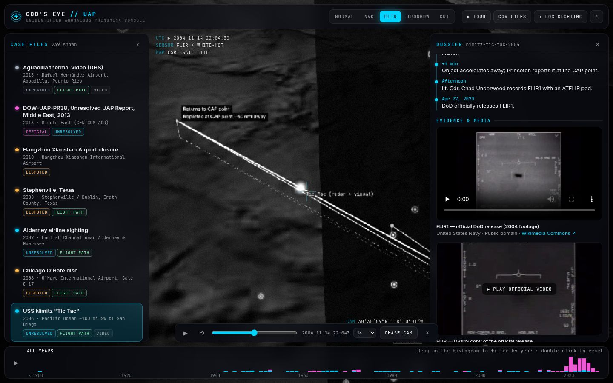
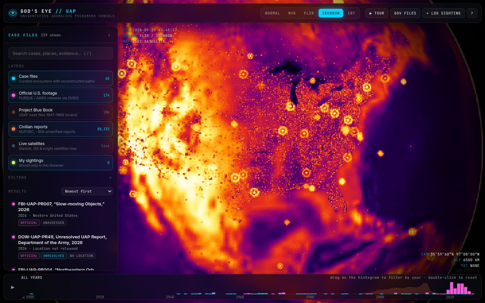
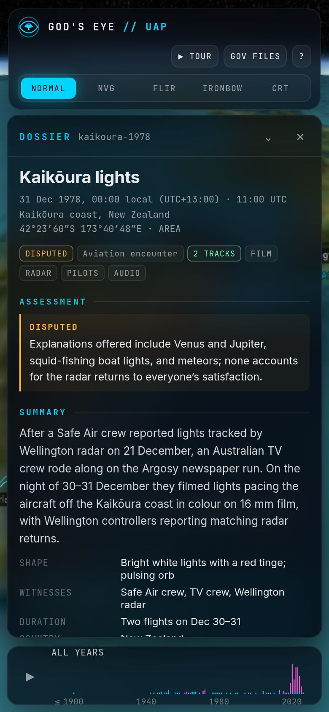
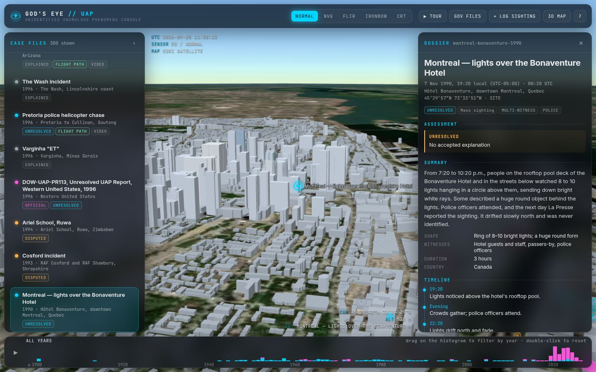
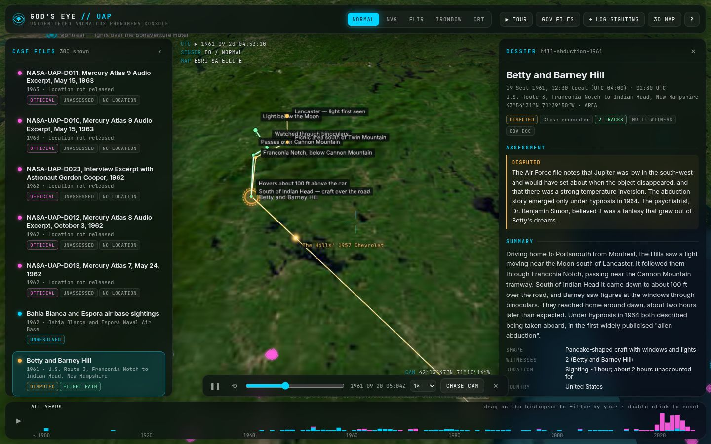
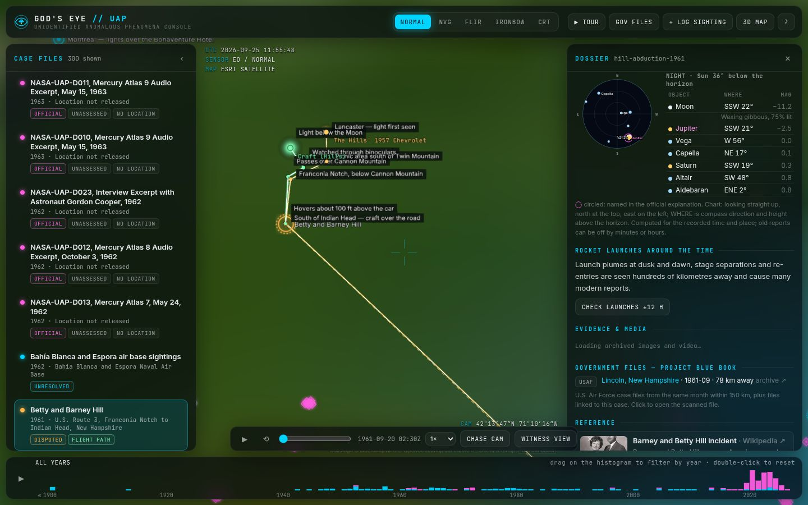
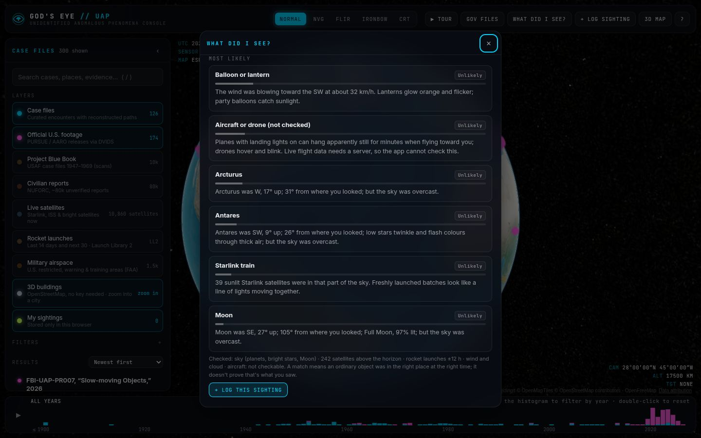
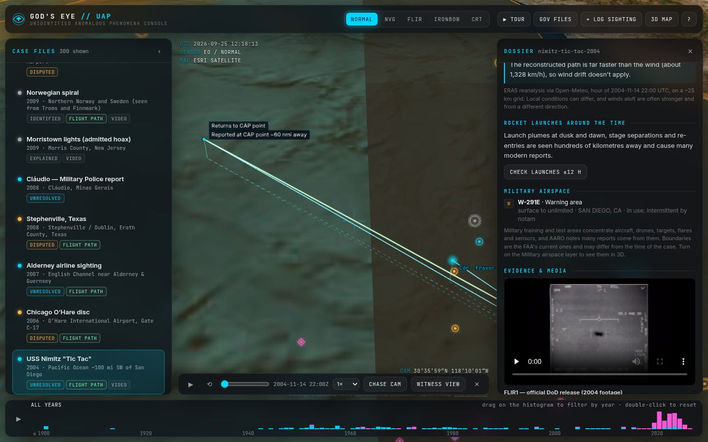

<div align="center">

# 👁 God's Eye // UAP

### A UAP-only edition of [God's Eye View](https://github.com/bilawalsidhu/gods-eye-view): every well-documented UFO/UAP encounter on a 3D globe, with reconstructed flight paths, the official U.S. government footage and files, and reference imagery of each place.


</div>

---

## What it does

| | |
|---|---|
| 🌍 **3D globe, no keys needed** | CesiumJS with Esri satellite imagery and keyless terrain (OSM fallback). |
| 🏙 **3D cities, two ways** | Free **OpenStreetMap 3D buildings** (via OpenFreeMap, no key) appear when you zoom into a town. Or paste **your own Google Maps API key** under **3D MAP** to switch to Google's photorealistic 3D tiles. The key stays in your browser. |
| 🛸 **126 curated case files** | Documented cases from 1561 to 2024 on every continent, each with evidence tags, witnesses, timeline, status (unresolved / disputed / explained / identified) and the official or best-supported explanation. Examples: Kenneth Arnold, Washington 1952, the Kinross F-89, the RB-47, Socorro, the Hills, Minot AFB 1968, Rendlesham, Tehran 1976, JAL 1628, Cosford, the Belgian wave, the Phoenix Lights, the Nimitz "Tic Tac", Gimbal/GoFast, Aguadilla, the 2023 shoot-downs and the 2024 New Jersey drones. |
| ✈️ **Flight paths you can replay** | 3D tracks at altitude for the UAP *and* the witness aircraft, interceptors, cars and balloons. Each has drop lines, a ground track and labelled waypoints. Playback runs on a real clock with a scrubber, speed control and a chase camera. Every track states its basis (radar, official report, witness reports, flight plan or approximate). |
| 🔭 **What did I see?** | A checker for your own sighting: enter the time, place, direction and how it moved, and it ranks the ordinary explanations it can test: planets, bright stars and the Moon; satellites for the last three weeks (sunlit, with Starlink trains and the ISS flagged); rocket launches; and lanterns or balloons carried by the wind. Aircraft are listed as not checkable. The top match can be saved to your log. Press `E`. |
| 🎬 **Story mode** | A narrated fly-through of any case: setting, what happened (with the flight path playing), the sky at that moment and the official assessment. Uses your browser's built-in voice. |
| 👁 **Witness view** | Replay an encounter from the witness's seat: the camera rides with the pilot, patrol car or ground observer and keeps the object in view (e.g. from Fravor's F/A-18F toward the Tic Tac). Press `V` during playback. |
| 🌌 **Sky at the time** | Every case and logged sighting shows a sky chart for that moment and place: Sun (day, twilight or night), Moon and phase, planets and the brightest stars. Objects named in the official explanation are circled, so you can check "it was Venus" yourself. At White Sands in 1957, for example, the setting Moon is right where the patrol looked. |
| 🌦 **Weather at the time** | Historical weather for every case since 1940 (ERA5 via Open-Meteo, no key): cloud layers, wind at 10 m and 100 m with drift direction, and whether a slow object's path ran with the wind. |
| 🛩 **Military airspace** | All 1,542 U.S. special-use areas (restricted, warning, military operations, alert, prohibited) from the FAA as 3D volumes, and a list of the areas each U.S. case falls in (Nimitz sits in warning area W-291). |
| 🚀 **Rocket launches** | A live layer of launches from the last 14 days and next 30 (Launch Library 2, no key), plus a button on every case since 1957 that lists launches within 12 hours and how far away they were. Launch plumes are a top source of modern reports. |
| 🎞 **Official U.S. footage** | All 174 UAP videos and images the Department of War / AARO have published on DVIDS, including the 2026 **PURSUE** releases from war.gov/UFO. They play inside the app. Region-only releases are drawn as rings, not fake pins. |
| 🗂 **Project Blue Book on the map** | 10,096 of the 10,763 scanned U.S. Air Force case files (1947–1969), geocoded offline. Click a point to read the original document and its OCR text. |
| 📸 **Reference images & video** | Archived photos, films and audio (e.g. the Trent photos, the Halt memo and tape, FLIR1). **Photos taken near each site** come from geotagged Wikimedia Commons. One-click Google satellite, Street View, Google Earth 3D and OpenStreetMap links, plus a ground-view fly-in. |
| 👥 **80,000 civilian reports** | NUFORC reports as a density layer (unverified, narratives removed). |
| 🛰 **Live sky check** | About 10,000 Starlink, ISS and bright satellites propagated live from CelesTrak, showing what is overhead right now. Satellites explain many modern reports. |
| ⇄ **Compare & filter by shape** | Put any two cases side by side (evidence, witnesses, path length, speed, altitude). Filter everything by shape: disc, tic tac, triangle, sphere, lights, formation. |
| 🔎 **Search places, sort by evidence** | Type a town to fly there (Photon geocoder, no key). Sort by **Strongest evidence**, a 0–10 documentation score (instrument data, imagery, official papers and trained observers count most) that is also shown on every case. |
| 🔗 **Shareable views** | The address bar keeps the camera position (`?view=lon,lat,height,heading,pitch`), so any view can be shared as a link. |
| 📓 **Log your own sighting** | Stored in your browser, exportable as GeoJSON, with links to report officially (NUFORC, AARO, GEIPAN). |
| 🎛 **God's Eye look** | NVG, FLIR white-hot, FLIR Ironbow and CRT sensor modes (keys `1`–`5`), tactical HUD, year histogram with brush filter, "sweep through history" and a guided tour. |
| 📚 **Government files library** | PURSUE, AARO, ODNI, NASA, NARA's UAP Records Collection, hearings, Blue Book, Sign/Grudge, Robertson, Condon, FBI Vault, CIA and AAWSAP, plus the UK MoD files, France's GEIPAN, Brazil and Australia. Public-domain PDFs are linked directly. |

<table><tr>
<td></td>
<td></td>
</tr><tr>
<td></td>
<td></td>
</tr><tr>
<td></td>
<td align="center"></td>
</tr><tr>
<td></td>
<td></td>
</tr><tr>
<td></td>
<td></td>
</tr><tr>
<td colspan="2"></td>
</tr><tr>
<td></td>
<td></td>
</tr><tr>
<td></td>
<td></td>
</tr></table>

## Quick start

```bash
git clone https://github.com/domw99/Gods-Eye-UAPs.git
cd Gods-Eye-UAPs
npm ci
npm run dev        # http://localhost:5173
```

Nothing needs a key. 3D buildings come from OpenStreetMap for free.

**Google photorealistic 3D (optional):** click **3D MAP** (or press `M`) and paste a Google Maps Platform key with the **Map Tiles API** enabled. The key is stored only in that browser's localStorage and sent only to `tile.googleapis.com`. You can remove it there at any time.

If you host your own copy, you can instead bake keys in: copy `.env.example` to `.env` and fill in the keys below.

| Key | What it adds |
|---|---|
| `VITE_GOOGLE_MAPS_API_KEY` | Google Photorealistic 3D Tiles for every visitor (needs the Map Tiles API enabled) |
| `VITE_CESIUM_ION_TOKEN` | Cesium World Terrain, plus Google 3D Tiles through ion |

Restrict browser keys to your domain at the provider, because anything built into the site is public.

**Deep links:**
- `#/case/nimitz-tic-tac-2004` — a curated case
- `#/official/1007777` — an official release (DVIDS id)
- `#/bluebook/1952-07-7273984-Tremonton-Utah-1377-` — a Blue Book file
- `?mode=nvg` — start in a sensor mode
- `?layers=bluebook,nuforc,launches` — start with extra layers on
- `?view=-104.5,33.7,25000,0,-35` — start at a camera position

**Keyboard:**
- `1`–`5` sensor modes
- `/` search
- `[` `]` previous / next case
- `Space` play or pause the flight path
- `T` tour
- `G` government files
- `L` log a sighting
- `M` 3D map settings (OSM buildings, your Google key)
- `E` what did I see? (sighting checker)
- `V` witness view during flight-path playback
- `H` hide the HUD
- `Esc` close

## Data pipeline

All data ships in `public/data/` and is rebuilt by scripts:

| Command | Source | Output |
|---|---|---|
| `npm run sync:official` | [DVIDS](https://www.dvidshub.net/unit/AARO) search → each asset page (title, date, description, duration, thumbnail). Regions are resolved by `src/data/regions.js` | `official-uap-media.json` |
| `npm run build:bluebook` | Internet Archive collection [`project-blue-book`](https://archive.org/details/project-blue-book), geocoded offline with [GeoNames](https://www.geonames.org/) cities1000 | `bluebook.json` |
| `npm run build:airspace` | FAA special-use airspace (ArcGIS open data), simplified | `airspace.json` |
| `npm run build:nuforc` | [planetsig/ufo-reports](https://github.com/planetsig/ufo-reports) (geocoded NUFORC) — facts only | `nuforc.json` |
| `npm run verify:media` | Checks every Commons file, Wikipedia title, DVIDS id and Blue Book id the case files reference | — |
| `npm test` | Vitest: case-file integrity (coordinates, taxonomy, monotonic track times, plausible altitudes), region resolver, Blue Book parser, dataset schemas | — |

Curated cases live in `src/data/cases/*.js`. Track points are written as `p(lat, lon, altitudeFeet, secondsFromStart, note)`. Add a case, run `npm run verify:media && npm test`, and it appears on the globe.

## How to read the map honestly

- **Status matters.** Many famous cases have mundane explanations: Roswell (Project Mogul), Phoenix Lights (A-10s and flares), Hudson Valley (Cessna formation), Aguadilla (AARO: objects drifting at wind speed). They are included with the explanation shown first. "Unresolved" means insufficient data, not "alien".
- **Paths are reconstructions.** They are built from the cited reports and radar accounts, and each track states its basis. Average speeds are simple distance ÷ time between reported points.
- **Official releases are often region-only.** The magenta ring is the whole area named in the release.
- **Blue Book pins mark the town in the file name**, not the exact sighting spot.
- **NUFORC reports are unverified.** They show where people report things.

## Project structure

```
src/
  app/        viewer.js (globe, imagery, terrain, 3D tiles) · effects.js (NVG/FLIR/CRT shaders)
  data/       cases/ (curated case files) · govFiles.js · regions.js · taxonomy.js · items.js
  layers/     items.js (case & release markers) · tracks.js (flight paths + playback)
              points.js (Blue Book / NUFORC) · satellites.js (live SGP4)
              buildings.js (keyless OpenStreetMap 3D buildings) · launches.js (launch pads)
              airspace.js (military airspace volumes)
  services/   wiki.js (Wikipedia summaries, Commons media & geosearch) · sky.js (planets, Moon, stars)
              launches.js (Launch Library 2) · weather.js (Open-Meteo) · airspace.js (FAA SUA)
              explain.js (sighting checker scoring)
  ui/         list.js · dossier.js · timeline.js · modals.js · skychart.js · story.js
scripts/      sync-dvids.mjs · build-bluebook.mjs · build-nuforc.mjs · build-airspace.mjs · verify-media.mjs
tests/        Vitest suites
docs/SPEC.md  the full product spec (the improved prompt this was built from)
```

## Deploy

`.github/workflows/pages.yml` tests, builds and publishes to GitHub Pages on every push to `main` or the default branch, and on demand from the Actions tab. To turn it on:

1. GitHub Pages needs a **public** repository on a free plan (private repos need a paid plan).
2. Go to **Settings → Pages** and set **Source: GitHub Actions**.
3. Re-run the "Deploy to GitHub Pages" workflow. The site appears at `https://<user>.github.io/Gods-Eye-UAPs/`.

CI (`ci.yml`) runs the tests and a build on every push and pull request. `sync-official.yml` re-syncs the official DVIDS releases every Monday, commits any new ones and redeploys the site.

**Contributing:** every case has **Suggest a correction** and **Suggest a case** buttons that open pre-filled GitHub issue forms (`.github/ISSUE_TEMPLATE/`). They work once the repository is public.

## Credits & licences

- **Code:** MIT (see [LICENSE](LICENSE)). The visual language follows [God's Eye View](https://github.com/bilawalsidhu/gods-eye-view) by Bilawal Sidhu (MIT). Its space-launch layer, cockpit view, in-app key panel and URL-serialised camera inspired the launch layer, witness view, 3D MAP panel and view links here. The shaders and code here are original.
- **Globe:** [CesiumJS](https://cesium.com/platform/cesiumjs/) (Apache-2.0).
- **Map data:**
  - Imagery: Esri World Imagery ("Powered by Esri")
  - Terrain: Re:Earth / Mapterhorn (CC BY 4.0)
  - OSM fallback: © OpenStreetMap contributors
  - 3D buildings: © OpenMapTiles © OpenStreetMap contributors, served by OpenFreeMap
- **Media & sources:**
  - Official footage: DVIDS / U.S. Department of War (public domain)
  - Media: Wikimedia Commons (the licence and author of each file are shown in the app)
  - Summaries: Wikipedia (CC BY-SA)
  - Blue Book scans: Internet Archive / NARA
- **Other data:**
  - Launches: [Launch Library 2](https://thespacedevs.com/llapi) by The Space Devs
  - Weather: [Open-Meteo](https://open-meteo.com/) (CC BY 4.0), ERA5 reanalysis by ECMWF / Copernicus
  - Military airspace: FAA Aeronautical Information Services (public domain)
  - Sky positions: [Astronomy Engine](https://github.com/cosinekitty/astronomy) (MIT)
  - Place search: [Photon](https://photon.komoot.io/) by komoot (OpenStreetMap data)
  - Geocoding: GeoNames (CC BY 4.0)
  - Civilian reports: NUFORC via planetsig
  - Satellites: CelesTrak

Third-party data keeps its own licence; the MIT licence covers only the code.

This project presents evidence and official assessments. It does not claim that any case is extraterrestrial.
